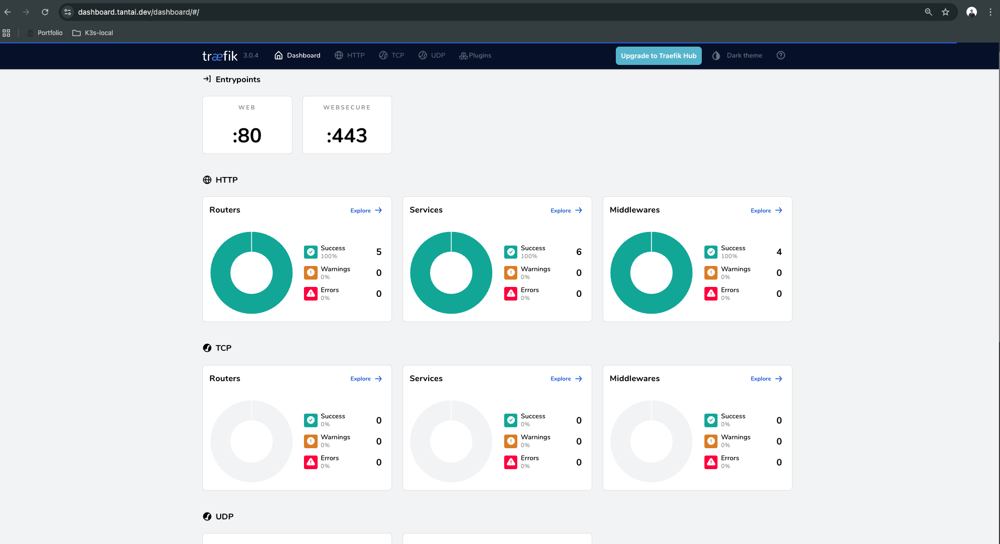
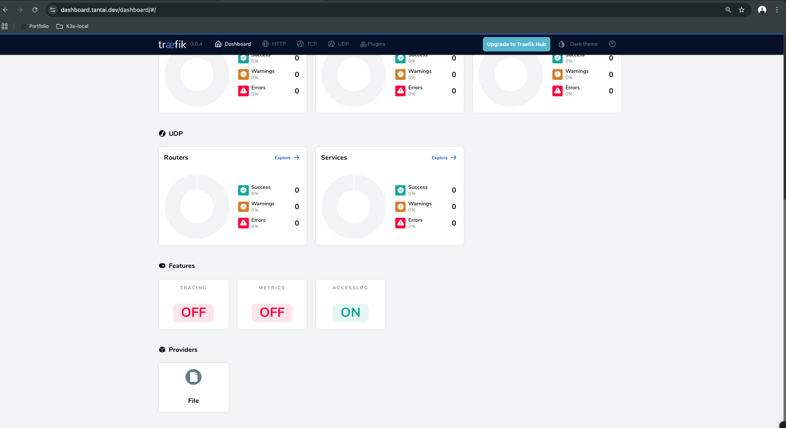
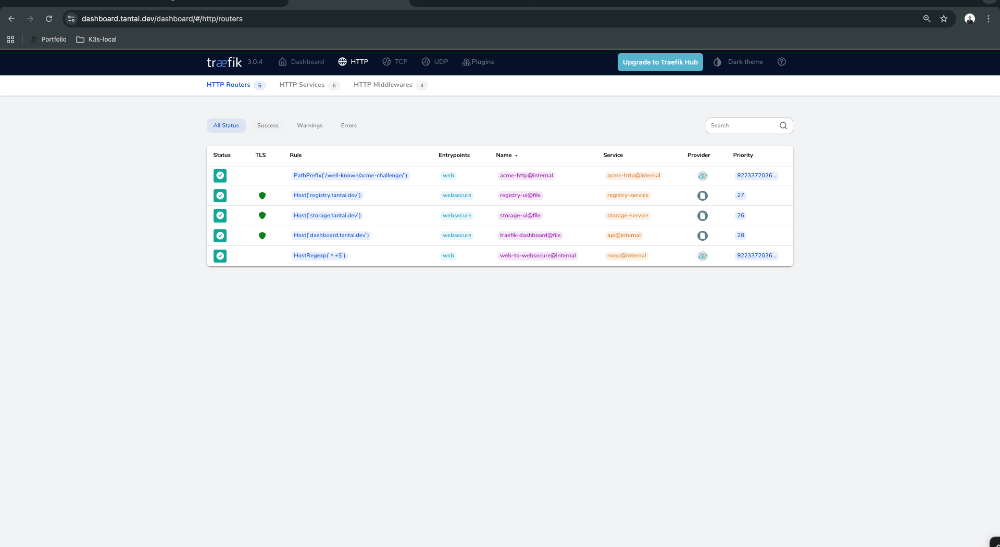
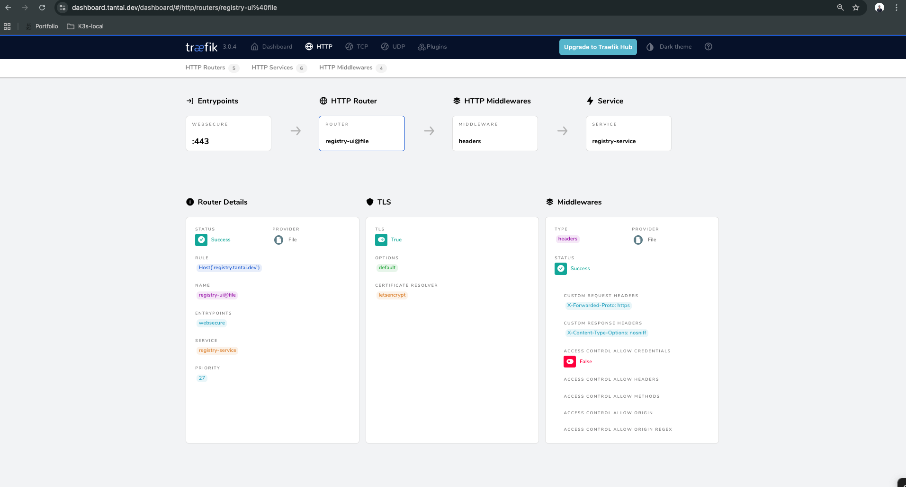
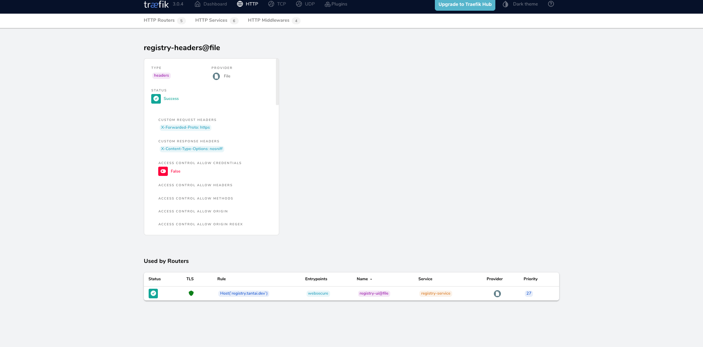

# API Gateway Setup (Traefik)

> Traefik API Gateway trên VM độc lập - Reverse proxy với SSL tự động và Dashboard

**Ngôn ngữ / Language:** [Tiếng Việt](#tiếng-việt) | [English](#english)

---

## Tiếng Việt

### Kiến trúc

```
┌─────────────────────────────────────────────────────────────────┐
│              API GATEWAY VM (192.168.1.21)                       │
│                    2 vCPU | 2GB RAM                             │
│                                                                 │
│  ┌───────────────────────────────────────────────────────────┐  │
│  │                 Traefik Container                         │  │
│  │                                                           │  │
│  │  Port 80  → HTTP (không redirect - để Let's Encrypt)      │  │
│  │  Port 443 → HTTPS với Let's Encrypt SSL                   │  │
│  │                                                           │  │
│  │  Routes:                                                  │  │
│  │  - dashboard.tantai.dev → Traefik Dashboard (Auth)        │  │
│  │  - storage.tantai.dev → MinIO Console (172.16.21.10:9001) │  │
│  │  - registry.tantai.dev → ZOT Registry (172.16.21.10:5000) │  │
│  │  - ci.tantai.dev → Woodpecker CI (172.16.21.21:8000)      │  │
│  │  - tantai.dev → K3s Traefik (172.16.21.100:80)            │  │
│  │  - *.tantai.dev → K3s Traefik (172.16.21.100:80)          │  │
│  └───────────────────────────────────────────────────────────┘  │
│                                                                 │
│  Config: /opt/traefik/                                          │
│  ├── config/traefik.yml (static)                                │
│  ├── config/dynamic_conf.yml (routes)                           │
│  ├── config/dynamic_localstack.yml (LocalStack routes)          │
│  ├── docker-compose.yml                                         │
│  └── acme.json (Let's Encrypt certificates)                     │
└─────────────────────────────────────────────────────────────────┘
```

### Dịch vụ

| Domain               | Backend                      | Mục đích               |
| -------------------- | ---------------------------- | ---------------------- |
| dashboard.tantai.dev | Traefik Dashboard (internal) | Quản lý Traefik routes |
| storage.tantai.dev   | 172.16.21.10:9001            | MinIO Console UI       |
| registry.tantai.dev  | 172.16.21.10:5000            | ZOT Registry UI        |
| ci.tantai.dev        | 172.16.21.21:8000            | Woodpecker CI          |
| tantai.dev           | 172.16.21.100:80 (K3s VIP)   | K3s Cluster Services   |
| *.tantai.dev         | 172.16.21.100:80 (K3s VIP)   | K3s Cluster Services   |

### Điểm nổi bật

| Pattern                      | Mô tả                                                                  |
| ---------------------------- | ---------------------------------------------------------------------- |
| **Password Hash Extraction** | Dùng `slurp` + `regex_replace` để extract bcrypt hash từ htpasswd file |
| **Dynamic Reload**           | Traefik `watch: true` tự reload config khi file thay đổi               |
| **ACME Auto-renewal**        | Let's Encrypt cert tự renew, lưu trong `acme.json`                     |
| **Basic Auth Middleware**    | Dashboard protected bằng BasicAuth middleware                          |

### Triển khai

#### Bước 1: Tạo VM

```bash
# Từ Admin VM hoặc local
cd terraform
terraform apply

# Lấy IP của API Gateway
terraform output api_gateway_ip
```

#### Bước 2: Update Inventory

Sửa `ansible/inventory/hosts.yml`:

```yaml
api_gateway_servers:
  hosts:
    api-gateway:
      ansible_host: <IP từ output>
      ansible_user: your-user
      vm_hostname: "api-gateway"
      static_ip: "192.168.1.21/24"
      gateway: "192.168.1.1"
```

#### Bước 3: Config Variables

Sửa `ansible/group_vars/api_gateway_servers.yml`:

```yaml
traefik_acme_email: "your-email@example.com" # Email cho Let's Encrypt
storage_backend_ip: "172.16.21.10" # IP của Storage VM
```

#### Bước 4: Chạy Ansible

```bash
cd ansible

# Setup cơ bản VM
ansible-playbook playbooks/setup-vm.yml -l api-gateway

# Deploy Traefik
ansible-playbook playbooks/setup-api-gateway.yml -l api-gateway
```

#### Bước 5: Config DNS

Trỏ các domain về IP của API Gateway VM:

```
dashboard.tantai.dev  → 192.168.1.21
storage.tantai.dev    → 192.168.1.21
registry.tantai.dev   → 192.168.1.21
ci.tantai.dev         → 192.168.1.21
tantai.dev            → 192.168.1.21 (hoặc external IP qua NAT)
```

### Sử dụng

#### Traefik Dashboard

- URL: `https://dashboard.tantai.dev`
- Login: `admin` / password từ `vault_traefik_dashboard_password`

### Hướng dẫn sử dụng Dashboard

Dashboard cung cấp cái nhìn toàn cảnh về "sức khỏe" của hệ thống Gateway mà không cần dùng command line.

#### 1. Trang Tổng quan (Overview)



| Thành phần      | Mô tả                                                                             |
| --------------- | --------------------------------------------------------------------------------- |
| **Entrypoints** | Các cổng Traefik đang lắng nghe: `:80` (Web) và `:443` (Websecure)                |
| **Routers**     | Số lượng quy tắc điều hướng và trạng thái (ví dụ: 5 HTTP Router đều Success 100%) |
| **Services**    | Số lượng dịch vụ backend đang chạy                                                |
| **Middlewares** | Số bộ lọc xử lý trung gian (Auth, Headers, Compress...)                           |
| **Features**    | Trạng thái AccessLog, Tracing, Metrics                                            |

#### 2. HTTP Routers (Bản đồ điều hướng)



Đây là phần quan trọng nhất để quản lý API Gateway:

| Cột             | Ý nghĩa                                                  |
| --------------- | -------------------------------------------------------- |
| **Status**      | ✓ Xanh = Router hoạt động bình thường                    |
| **TLS**         | 🛡️ Xanh = HTTPS hợp lệ với Let's Encrypt                 |
| **Rule**        | Điều kiện kích hoạt, ví dụ: `Host('storage.tantai.dev')` |
| **Entrypoints** | Request đi vào từ cổng nào (`websecure` = 443)           |
| **Service**     | Backend đích nhận request                                |
| **Priority**    | Độ ưu tiên khi có nhiều rule chồng chéo                  |

#### 3. Services (Backend Health)



Xem trạng thái các backend:

- **Load Balancer URL**: Địa chỉ IP:Port của backend
- **Health Status**: Xanh = healthy, Đỏ = unhealthy (giúp debug nhanh)

#### 4. Middlewares (Bộ lọc)



Danh sách các middleware đang hoạt động:

- **BasicAuth**: Xác thực cho Dashboard
- **Headers**: Thêm security headers
- **Compress**: Nén response

#### 5. Chi tiết Router



Click vào router để xem:

- Middleware chain đang áp dụng
- TLS certificate info
- Service loadbalancer config

#### MinIO Console

- URL: `https://storage.tantai.dev`
- Tự động forward đến MinIO Console trên Storage VM

#### ZOT Registry

- URL: `https://registry.tantai.dev`
- Tự động forward đến ZOT Registry trên Storage VM

### Routing đến K3s Cluster

API Gateway forward tất cả traffic cho `tantai.dev` và `*.tantai.dev` đến K3s cluster VIP (`172.16.21.100:80`). TLS được xử lý bởi Traefik trong K3s, không phải API Gateway.

**Cấu hình đặc biệt:**
- **Entrypoint `web` (HTTP)**: Không redirect tự động để Let's Encrypt HTTP-01 challenge hoạt động
- **Router `k3s-services`**: Có cả `web` và `websecure` entrypoints, không có TLS config (TLS do K3s xử lý)
- **Priority**: Router `k3s-services` có priority cao để match trước các router khác

```yaml
# ansible/templates/traefik/dynamic_conf.yml.j2
k3s-services:
  rule: "Host(`tantai.dev`)"
  service: k3s-traefik-service
  entryPoints:
    - web      # HTTP - cần cho Let's Encrypt HTTP-01 challenge
    - websecure # HTTPS
  priority: 1  # Higher priority

k3s-traefik-service:
  loadBalancer:
    servers:
      - url: "http://172.16.21.100:80"  # K3s VIP
```

**Lưu ý quan trọng:**
- Traefik v3 không hỗ trợ wildcard trong rule `Host()`, nên chỉ dùng `Host('tantai.dev')` thay vì `Host('tantai.dev') || Host('*.tantai.dev')`
- Subdomain routing được xử lý bởi Traefik trong K3s

### Thêm Route mới

Để thêm route cho VM khác, sửa `ansible/templates/traefik/dynamic_conf.yml.j2`:

```yaml
http:
  routers:
    # Thêm router mới
    my-new-service:
      rule: "Host(`myservice.tantai.dev`)"
      service: my-service
      entryPoints:
        - websecure
      tls:
        certResolver: letsencrypt

  services:
    # Thêm service mới
    my-service:
      loadBalancer:
        servers:
          - url: "http://172.16.21.20:8080" # IP:Port của backend
```

Sau đó chạy lại playbook:

```bash
ansible-playbook playbooks/setup-api-gateway.yml -l api-gateway
```

Traefik sẽ tự động reload config (nhờ `watch: true`).

### Cấu hình HTTP Entrypoint

**Quan trọng:** Entrypoint `web` (port 80) **KHÔNG** có redirect tự động HTTP → HTTPS để Let's Encrypt HTTP-01 challenge hoạt động.

```yaml
# ansible/templates/traefik/traefik.yml.j2
entryPoints:
  web:
    address: ":80"
    # No automatic redirect - Let's Encrypt HTTP-01 challenge needs HTTP access
    # Redirects will be handled by middleware on specific routers

  websecure:
    address: ":443"
```

Nếu cần redirect HTTP → HTTPS cho các service khác, thêm middleware redirect vào router cụ thể.

### Troubleshooting

#### Kiểm tra logs

```bash
ssh api-gateway
cd /opt/traefik
docker-compose logs -f traefik
```

#### Kiểm tra certificates

```bash
ssh api-gateway
cat /opt/traefik/acme.json | jq .
```

#### Test routes

```bash
# Test HTTP (không redirect)
curl -I http://dashboard.tantai.dev

# Test HTTPS
curl -I https://dashboard.tantai.dev

# Test K3s routing
curl -H "Host: tantai.dev" http://192.168.1.21/
```

#### Vấn đề với Let's Encrypt HTTP-01 Challenge

Nếu certificate không được issue, kiểm tra:

1. **Entrypoint `web` không redirect**: Đảm bảo `traefik.yml` không có redirect tự động ở entrypoint level
2. **Router có cả `web` và `websecure`**: Router `k3s-services` cần có cả 2 entrypoints
3. **NAT/Port Forwarding**: Đảm bảo router forward port 80 và 443 từ external IP về `192.168.1.21`
4. **DNS**: Đảm bảo domain trỏ đúng về external IP

```bash
# Test challenge endpoint từ external
curl -H "Host: tantai.dev" http://<external-ip>/.well-known/acme-challenge/<token>

# Kiểm tra challenge status trong K3s
kubectl get challenge -n <namespace>
kubectl describe challenge -n <namespace>
```

---

## English

### Architecture

Traefik API Gateway on standalone VM - Reverse proxy with automatic SSL and Dashboard.

### Services

| Domain               | Backend                      | Purpose               |
| -------------------- | ---------------------------- | --------------------- |
| dashboard.tantai.dev | Traefik Dashboard (internal) | Manage Traefik routes |
| storage.tantai.dev   | 172.16.21.10:9001            | MinIO Console UI      |
| registry.tantai.dev  | 172.16.21.10:5000            | ZOT Registry UI       |
| ci.tantai.dev        | 172.16.21.21:8000            | Woodpecker CI         |
| tantai.dev           | 172.16.21.100:80 (K3s VIP)   | K3s Cluster Services  |
| *.tantai.dev         | 172.16.21.100:80 (K3s VIP)   | K3s Cluster Services  |

### Highlights

| Pattern                      | Description                                                         |
| ---------------------------- | ------------------------------------------------------------------- |
| **Password Hash Extraction** | Uses `slurp` + `regex_replace` to extract bcrypt hash from htpasswd |
| **Dynamic Reload**           | Traefik `watch: true` auto-reloads config on file changes           |
| **ACME Auto-renewal**        | Let's Encrypt cert auto-renews, stored in `acme.json`               |
| **Basic Auth Middleware**    | Dashboard protected with BasicAuth middleware                       |

### Deployment

#### Step 1: Create VM

```bash
cd terraform
terraform apply
terraform output api_gateway_ip
```

#### Step 2: Update Inventory

Edit `ansible/inventory/hosts.yml`:

```yaml
api_gateway_servers:
  hosts:
    api-gateway:
      ansible_host: <IP from output>
      ansible_user: your-user
      vm_hostname: "api-gateway"
      static_ip: "192.168.1.21/24"
      gateway: "192.168.1.1"
```

#### Step 3: Configure Variables

Edit `ansible/group_vars/api_gateway_servers.yml`:

```yaml
traefik_acme_email: "your-email@example.com"
storage_backend_ip: "172.16.21.10"
```

#### Step 4: Run Ansible

```bash
cd ansible
ansible-playbook playbooks/setup-vm.yml -l api-gateway
ansible-playbook playbooks/setup-api-gateway.yml -l api-gateway
```

#### Step 5: Configure DNS

Point domains to API Gateway VM IP:

```
dashboard.tantai.dev  → 192.168.1.21
storage.tantai.dev    → 192.168.1.21
registry.tantai.dev   → 192.168.1.21
ci.tantai.dev         → 192.168.1.21
tantai.dev            → 192.168.1.21 (hoặc external IP qua NAT)
```

### Usage

- **Traefik Dashboard**: `https://dashboard.tantai.dev`
- **MinIO Console**: `https://storage.tantai.dev`
- **ZOT Registry**: `https://registry.tantai.dev`
- **Woodpecker CI**: `https://ci.tantai.dev`
- **K3s Services**: `https://tantai.dev` (forwarded to K3s cluster)

### Routing to K3s Cluster

The API Gateway forwards all traffic for `tantai.dev` to the K3s cluster VIP (`172.16.21.100:80`). TLS is handled by Traefik in K3s, not by the API Gateway.

**Special Configuration:**
- **Entrypoint `web` (HTTP)**: No automatic redirect to allow Let's Encrypt HTTP-01 challenge
- **Router `k3s-services`**: Has both `web` and `websecure` entrypoints, no TLS config (TLS handled by K3s)
- **Priority**: Router `k3s-services` has high priority to match before other routers

**Important Notes:**
- Traefik v3 does not support wildcards in `Host()` rule, so use only `Host('tantai.dev')` instead of `Host('tantai.dev') || Host('*.tantai.dev')`
- Subdomain routing is handled by Traefik in K3s

### HTTP Entrypoint Configuration

**Important:** The `web` entrypoint (port 80) does **NOT** have automatic HTTP → HTTPS redirect to allow Let's Encrypt HTTP-01 challenge to work.

If you need HTTP → HTTPS redirect for other services, add redirect middleware to specific routers.

### Adding New Routes

Edit `ansible/templates/traefik/dynamic_conf.yml.j2` and add new routers/services, then rerun the playbook. Traefik will auto-reload config.

### Troubleshooting Let's Encrypt HTTP-01 Challenge

If certificate is not being issued, check:

1. **Entrypoint `web` has no redirect**: Ensure `traefik.yml` has no automatic redirect at entrypoint level
2. **Router has both `web` and `websecure`**: Router `k3s-services` needs both entrypoints
3. **NAT/Port Forwarding**: Ensure router forwards ports 80 and 443 from external IP to `192.168.1.21`
4. **DNS**: Ensure domain points correctly to external IP
